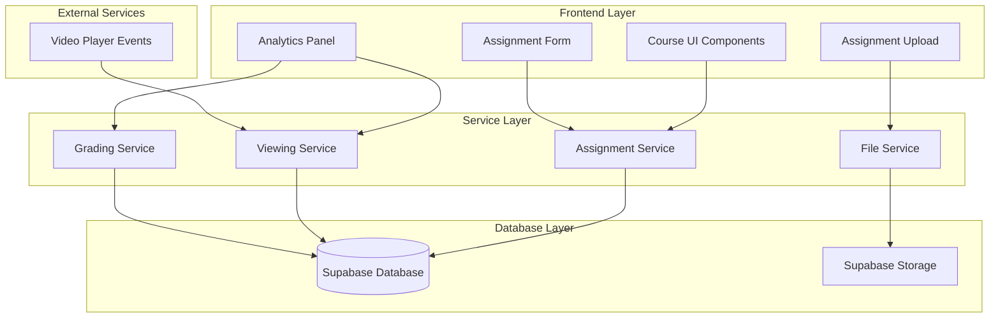

# Design Document: Assignment Submission System

## Overview

This design document outlines the implementation of a comprehensive assignment submission system for the existing Next.js course website. The system integrates seamlessly with the current Supabase backend and adds three core capabilities:

1. **Assignment Management**: Create and manage assignments linked to course units
2. **File Submission System**: Secure file upload and storage with Supabase Storage
3. **Advanced Analytics**: Detailed lesson viewing tracking and course grading

The design maintains compatibility with the existing course structure (units, lessons, course acknowledgments) while extending functionality to support assignment workflows and detailed progress tracking.

## Architecture

### System Components



### Data Flow Architecture

1. **Assignment Creation Flow**: Admin creates assignment → Database storage → UI display
2. **File Submission Flow**: Student uploads files → Supabase Storage → Database tracking → Confirmation
3. **Viewing Analytics Flow**: Video events → Service processing → Database storage → Grade calculation
4. **Grade Calculation Flow**: Lesson completion + Assignment scores → Weighted calculation → Display

## Components and Interfaces

### Database Schema Extensions

#### New Tables

**assignments**
```sql
CREATE TABLE assignments (
  id SERIAL PRIMARY KEY,
  unit_id INTEGER REFERENCES units(id) ON DELETE CASCADE,
  title VARCHAR(255) NOT NULL,
  description TEXT,
  due_date TIMESTAMP WITH TIME ZONE,
  max_file_size_mb INTEGER DEFAULT 10,
  allowed_file_types TEXT[] DEFAULT ARRAY['pdf', 'doc', 'docx', 'txt'],
  created_at TIMESTAMP WITH TIME ZONE DEFAULT NOW(),
  updated_at TIMESTAMP WITH TIME ZONE DEFAULT NOW()
);
```

**assignment_submissions**
```sql
CREATE TABLE assignment_submissions (
  id SERIAL PRIMARY KEY,
  assignment_id INTEGER REFERENCES assignments(id) ON DELETE CASCADE,
  user_id UUID REFERENCES auth.users(id) ON DELETE CASCADE,
  submission_date TIMESTAMP WITH TIME ZONE DEFAULT NOW(),
  status VARCHAR(50) DEFAULT 'submitted',
  created_at TIMESTAMP WITH TIME ZONE DEFAULT NOW()
);
```

**submission_files**
```sql
CREATE TABLE submission_files (
  id SERIAL PRIMARY KEY,
  submission_id INTEGER REFERENCES assignment_submissions(id) ON DELETE CASCADE,
  original_filename VARCHAR(255) NOT NULL,
  stored_filename VARCHAR(255) NOT NULL,
  file_size_bytes BIGINT NOT NULL,
  file_type VARCHAR(50) NOT NULL,
  storage_path TEXT NOT NULL,
  uploaded_at TIMESTAMP WITH TIME ZONE DEFAULT NOW()
);
```

**lesson_viewing_sessions**
```sql
CREATE TABLE lesson_viewing_sessions (
  id SERIAL PRIMARY KEY,
  user_id UUID REFERENCES auth.users(id) ON DELETE CASCADE,
  lesson_id INTEGER REFERENCES lessons(id) ON DELETE CASCADE,
  session_start TIMESTAMP WITH TIME ZONE DEFAULT NOW(),
  session_end TIMESTAMP WITH TIME ZONE,
  total_watch_time_seconds INTEGER DEFAULT 0,
  completion_percentage DECIMAL(5,2) DEFAULT 0.00,
  is_completed BOOLEAN DEFAULT FALSE,
  created_at TIMESTAMP WITH TIME ZONE DEFAULT NOW(),
  updated_at TIMESTAMP WITH TIME ZONE DEFAULT NOW()
);
```

**course_grades**
```sql
CREATE TABLE course_grades (
  id SERIAL PRIMARY KEY,
  user_id UUID REFERENCES auth.users(id) ON DELETE CASCADE,
  course_id VARCHAR(100) NOT NULL,
  lesson_completion_percentage DECIMAL(5,2) DEFAULT 0.00,
  assignment_completion_percentage DECIMAL(5,2) DEFAULT 0.00,
  total_grade DECIMAL(5,2) DEFAULT 0.00,
  last_updated TIMESTAMP WITH TIME ZONE DEFAULT NOW()
);
```

### TypeScript Interfaces

#### Core Types
```typescript
export interface Assignment {
  id: number;
  unit_id: number;
  title: string;
  description?: string;
  due_date?: string;
  max_file_size_mb: number;
  allowed_file_types: string[];
  created_at: string;
  updated_at: string;
}

export interface AssignmentSubmission {
  id: number;
  assignment_id: number;
  user_id: string;
  submission_date: string;
  status: 'submitted' | 'graded' | 'late';
  files: SubmissionFile[];
}

export interface SubmissionFile {
  id: number;
  submission_id: number;
  original_filename: string;
  stored_filename: string;
  file_size_bytes: number;
  file_type: string;
  storage_path: string;
  uploaded_at: string;
}

export interface LessonViewingSession {
  id: number;
  user_id: string;
  lesson_id: number;
  session_start: string;
  session_end?: string;
  total_watch_time_seconds: number;
  completion_percentage: number;
  is_completed: boolean;
}

export interface CourseGrade {
  id: number;
  user_id: string;
  course_id: string;
  lesson_completion_percentage: number;
  assignment_completion_percentage: number;
  total_grade: number;
  last_updated: string;
}
```

### Service Layer Architecture

#### AssignmentService
```typescript
export interface AssignmentService {
  // Assignment management
  createAssignment(assignment: Omit<Assignment, 'id' | 'created_at' | 'updated_at'>): Promise<Assignment>;
  getAssignmentsByUnit(unitId: number): Promise<Assignment[]>;
  updateAssignment(id: number, updates: Partial<Assignment>): Promise<Assignment>;
  deleteAssignment(id: number): Promise<void>;
  
  // Submission management
  submitAssignment(assignmentId: number, userId: string, files: File[]): Promise<AssignmentSubmission>;
  getSubmissionsByUser(userId: string, assignmentId?: number): Promise<AssignmentSubmission[]>;
  getSubmissionsByAssignment(assignmentId: number): Promise<AssignmentSubmission[]>;
}
```

#### FileService
```typescript
export interface FileService {
  uploadFiles(files: File[], assignmentId: number, userId: string): Promise<SubmissionFile[]>;
  downloadFile(fileId: number, userId: string): Promise<Blob>;
  deleteFile(fileId: number, userId: string): Promise<void>;
  validateFile(file: File, allowedTypes: string[], maxSizeMB: number): Promise<boolean>;
  generateSecureUrl(filePath: string, expiresIn?: number): Promise<string>;
}
```

#### ViewingAnalyticsService
```typescript
export interface ViewingAnalyticsService {
  startViewingSession(userId: string, lessonId: number): Promise<LessonViewingSession>;
  updateViewingProgress(sessionId: number, watchTimeSeconds: number, completionPercentage: number): Promise<void>;
  endViewingSession(sessionId: number): Promise<LessonViewingSession>;
  getViewingHistory(userId: string, lessonId?: number): Promise<LessonViewingSession[]>;
  calculateLessonCompletion(userId: string, lessonId: number): Promise<number>;
}
```

#### GradingService
```typescript
export interface GradingService {
  calculateCourseGrade(userId: string, courseId: string): Promise<CourseGrade>;
  updateLessonProgress(userId: string, courseId: string): Promise<void>;
  updateAssignmentProgress(userId: string, courseId: string): Promise<void>;
  getGradeBreakdown(userId: string, courseId: string): Promise<GradeBreakdown>;
}

export interface GradeBreakdown {
  lessonStats: {
    totalLessons: number;
    completedLessons: number;
    completionPercentage: number;
  };
  assignmentStats: {
    totalAssignments: number;
    submittedAssignments: number;
    completionPercentage: number;
  };
  totalGrade: number;
}
```

## Data Models

### File Storage Structure

**Supabase Storage Bucket**: `assignment-submissions`

**File Path Pattern**: `{courseId}/{assignmentId}/{userId}/{timestamp}_{originalFilename}`

**Example**: `aws-course/1/user123/1704067200000_project-report.pdf`

### Viewing Analytics Data Model

**Session Tracking Logic**:
- Session starts when video play event is detected
- Progress updates every 10 seconds during playback
- Session ends on pause, video end, or page navigation
- Completion threshold: 80% of video duration watched

**Completion Calculation**:
```typescript
const completionPercentage = (totalWatchTimeSeconds / videoDurationSeconds) * 100;
const isCompleted = completionPercentage >= 80;
```

### Grade Calculation Model

**Weighted Scoring**:
- Lesson Completion: 60% of total grade
- Assignment Submission: 40% of total grade

**Formula**:
```typescript
const totalGrade = (lessonCompletionPercentage * 0.6) + (assignmentCompletionPercentage * 0.4);
```

## Error Handling

### File Upload Error Scenarios

1. **File Size Exceeded**: Return specific error with max size limit
2. **Invalid File Type**: Return list of allowed file types
3. **Storage Quota Exceeded**: Return storage limit information
4. **Network Failure**: Implement retry mechanism with exponential backoff
5. **Authentication Failure**: Redirect to login with return URL

### Database Error Handling

1. **Connection Failures**: Implement connection pooling and retry logic
2. **Constraint Violations**: Return user-friendly validation messages
3. **Transaction Failures**: Implement rollback mechanisms for multi-step operations
4. **Concurrent Access**: Use optimistic locking for grade calculations

### Video Analytics Error Handling

1. **Player Event Failures**: Graceful degradation without blocking video playback
2. **Session Timeout**: Auto-save progress before session expiration
3. **Duplicate Sessions**: Merge or replace existing active sessions
4. **Invalid Progress Data**: Validate and sanitize progress values

## Testing Strategy

### Unit Testing Approach

**Service Layer Testing**:
- Mock Supabase client for isolated service testing
- Test file validation logic with various file types and sizes
- Test grade calculation formulas with edge cases
- Test viewing session state management

**Component Testing**:
- Test assignment form validation and submission
- Test file upload progress and error states
- Test grade display components with various data states
- Test assignment display integration with unit components

### Property-Based Testing

The system will implement comprehensive property-based testing to validate universal correctness properties across all components and data flows.

## Correctness Properties

*A property is a characteristic or behavior that should hold true across all valid executions of a system—essentially, a formal statement about what the system should do. Properties serve as the bridge between human-readable specifications and machine-verifiable correctness guarantees.*

### Assignment Management Properties

**Property 1: Assignment-Unit Association**
*For any* assignment creation request with a valid unit ID, the created assignment should be properly linked to that unit in the database
**Validates: Requirements 1.1**

**Property 2: Assignment Data Completeness**
*For any* assignment creation with required fields (title, description, due date, file types), all provided data should be stored accurately in the database
**Validates: Requirements 1.2**

**Property 3: Assignment Display Integration**
*For any* unit that has an associated assignment, the assignment should appear at the end of the unit content in the UI
**Validates: Requirements 1.3, 4.1**

**Property 4: Assignment Visibility**
*For any* assignment defined for a unit, all authenticated students should be able to view the assignment
**Validates: Requirements 1.4**

**Property 5: Assignment Update Propagation**
*For any* assignment update operation, the changes should be immediately reflected in all student views
**Validates: Requirements 1.5**

### File Upload and Validation Properties

**Property 6: File Type Validation**
*For any* file upload attempt, files should be accepted only if their type matches the assignment's allowed file types
**Validates: Requirements 2.2**

**Property 7: File Storage Integrity**
*For any* valid file upload, the file should be stored in Supabase Storage with a unique identifier and retrievable path
**Validates: Requirements 2.3**

**Property 8: File Metadata Preservation**
*For any* uploaded file, the system should preserve and store the original filename, file size, and upload timestamp
**Validates: Requirements 2.4**

**Property 9: Upload Error Handling**
*For any* failed file upload, the system should display descriptive error messages and provide retry functionality
**Validates: Requirements 2.5**

**Property 10: File Size Validation**
*For any* file upload that exceeds the assignment's size limit, the upload should be rejected with appropriate notification
**Validates: Requirements 2.6**

### Submission Tracking Properties

**Property 11: Submission Timestamp Recording**
*For any* completed file submission, the system should record an accurate submission timestamp
**Validates: Requirements 3.1**

**Property 12: Submission Relationship Integrity**
*For any* completed submission, the system should maintain proper relationships between student ID, assignment ID, and file references
**Validates: Requirements 3.2**

**Property 13: Submission History Display**
*For any* student viewing an assignment, their previous submissions (if any) should be displayed in the interface
**Validates: Requirements 3.3**

**Property 14: Submission History Preservation**
*For any* assignment with multiple submissions from the same student, all submission records should be preserved in chronological order
**Validates: Requirements 3.4**

**Property 15: Completion Status Updates**
*For any* successful assignment submission, the student's completion status for that assignment should be updated immediately
**Validates: Requirements 3.5**

### UI Display and Integration Properties

**Property 16: Conditional Assignment Display**
*For any* unit without an associated assignment, no assignment section should appear in the unit display
**Validates: Requirements 4.2**

**Property 17: Assignment Interface Completeness**
*For any* displayed assignment, the interface should include assignment details, requirements, and submission functionality
**Validates: Requirements 4.3**

**Property 18: Completion Status Indication**
*For any* assignment that a student has submitted, the UI should provide clear visual indication of completion status
**Validates: Requirements 4.4**

**Property 19: Due Date Prominence**
*For any* assignment with a due date, the deadline should be prominently displayed in the assignment interface
**Validates: Requirements 4.5**

### Lesson Viewing Analytics Properties

**Property 20: Viewing Session Initiation**
*For any* lesson playback start event, a viewing session record should be created with accurate start timestamp
**Validates: Requirements 5.1**

**Property 21: Pause/Stop Event Tracking**
*For any* lesson pause or stop event, the system should record the event time and calculate duration watched up to that point
**Validates: Requirements 5.2**

**Property 22: Resume Functionality**
*For any* lesson resume event, the system should continue timing from the resume point and maintain session continuity
**Validates: Requirements 5.3**

**Property 23: Session Completion Calculation**
*For any* ended viewing session, the system should accurately calculate total watch time and completion percentage
**Validates: Requirements 5.4**

**Property 24: Completion Threshold Logic**
*For any* lesson viewing session that reaches 80% or more completion, the lesson should be marked as completed
**Validates: Requirements 5.5**

**Property 25: Analytics Reporting**
*For any* administrator accessing analytics, detailed viewing reports should be available for all students and lessons
**Validates: Requirements 5.6**

### Grade Calculation Properties

**Property 26: Course Grade Calculation**
*For any* student's course progress, the total grade should be calculated by combining lesson completion percentage (60% weight) and assignment completion percentage (40% weight)
**Validates: Requirements 6.1, 6.4**

**Property 27: Lesson Completion Credit**
*For any* lesson viewing session that reaches 80% completion, full credit should be awarded for that lesson
**Validates: Requirements 6.2**

**Property 28: Assignment Score Updates**
*For any* assignment submission, the student's assignment completion score should be updated to reflect the new submission
**Validates: Requirements 6.3**

**Property 29: Progress Display Completeness**
*For any* student viewing their progress, the display should include lesson completion percentage, assignment scores, and total grade
**Validates: Requirements 6.5**

### Data Integrity Properties

**Property 30: Foreign Key Relationship Integrity**
*For any* submission record creation, all foreign key relationships (user, assignment, files) should be properly maintained
**Validates: Requirements 7.2**

**Property 31: Error Handling Consistency**
*For any* database operation failure, the system should handle errors gracefully while maintaining data consistency
**Validates: Requirements 7.3**

**Property 32: Query Result Accuracy**
*For any* submission data query, the returned results should be accurate and reflect the current database state
**Validates: Requirements 7.4**

**Property 33: Audit Trail Completeness**
*For any* historical data access request, complete audit trails should be available for all submission and viewing activities
**Validates: Requirements 7.5**

### User Experience Properties

**Property 34: Upload Progress Feedback**
*For any* file upload in progress, the system should display progress indicators and status updates
**Validates: Requirements 8.2**

**Property 35: Success Confirmation**
*For any* successfully completed upload, the system should provide clear confirmation messages
**Validates: Requirements 8.3**

**Property 36: Error Message Quality**
*For any* system error, the displayed error message should be helpful and include suggested solutions where applicable
**Validates: Requirements 8.5**

### Security Properties

**Property 37: Malicious File Detection**
*For any* uploaded file, the system should scan for malicious content and reject unsafe files
**Validates: Requirements 9.1**

**Property 38: Time-Limited URL Security**
*For any* generated file access URL, the URL should have appropriate time-based expiration for security
**Validates: Requirements 9.3**

**Property 39: File Ownership Verification**
*For any* file download request, the system should verify that the requesting user owns the file before allowing access
**Validates: Requirements 9.4**

**Property 40: Administrative Access Control**
*For any* administrative access to submissions, the system should verify appropriate administrative permissions
**Validates: Requirements 9.5**

## Testing Strategy

### Dual Testing Approach

The assignment submission system will implement both unit testing and property-based testing to ensure comprehensive coverage:

**Unit Tests**: Focus on specific examples, edge cases, and error conditions including:
- Assignment creation with various field combinations
- File upload with different file types and sizes
- Grade calculation with specific completion scenarios
- UI component rendering with different data states
- Error handling for specific failure scenarios

**Property Tests**: Verify universal properties across all inputs including:
- File validation logic across all possible file types and sizes
- Grade calculation accuracy across all completion combinations
- Submission tracking integrity across all user and assignment combinations
- Security controls across all access scenarios

### Property-Based Testing Configuration

**Testing Framework**: Fast-check (for TypeScript/JavaScript)
**Test Configuration**: Minimum 100 iterations per property test
**Test Tagging**: Each property test will reference its design document property

**Example Test Tags**:
- **Feature: assignment-submission-system, Property 1: Assignment-Unit Association**
- **Feature: assignment-submission-system, Property 26: Course Grade Calculation**

### Integration Testing Strategy

**Database Integration**: Test all service layers against actual Supabase instances
**File Storage Integration**: Test file upload/download flows with Supabase Storage
**Authentication Integration**: Test all access controls with Supabase Auth
**UI Integration**: Test complete user workflows from assignment creation to grade viewing

### Performance Testing Considerations

**File Upload Performance**: Test upload speeds and timeout handling for large files
**Analytics Query Performance**: Test viewing analytics queries with large datasets
**Grade Calculation Performance**: Test grade recalculation with many students and assignments
**Concurrent Access**: Test system behavior under concurrent file uploads and submissions