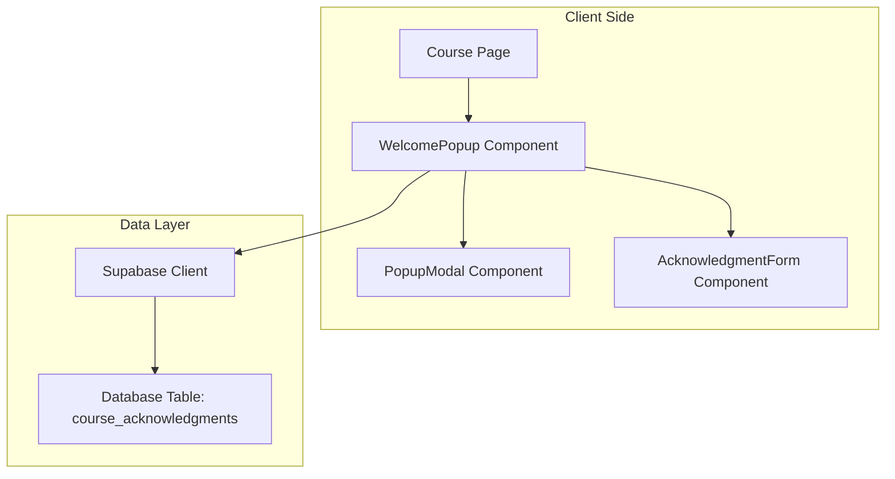

# Design Document: Course Welcome Popup

## Overview

מערכת הודעה צפה לסטודנטיות חדשות המציגה הנחיות קורס ותנאי שימוש. המערכת בנויה כרכיב React עם אחסון מצב ב-Supabase, ומבטיחה שכל סטודנטית תראה את המידע החשוב לפני תחילת הלמידה.

## Architecture

המערכת בנויה על ארכיטקטורה של שלוש שכבות:



**שכבות המערכת:**
1. **UI Layer**: רכיבי React לתצוגה ואינטראקציה
2. **Logic Layer**: לוגיקת בדיקת סטטוס ושמירת נתונים
3. **Data Layer**: Supabase לאחסון מצב האישורים

## Components and Interfaces

### WelcomePopup Component

רכיב ראשי המנהל את הצגת ההודעה הצפה:

```typescript
interface WelcomePopupProps {
  userId: string;
  courseId: string;
  onAcknowledged: () => void;
}

interface WelcomePopupState {
  isVisible: boolean;
  isLoading: boolean;
  hasAcknowledged: boolean;
}
```

### AcknowledgmentForm Component

טופס האישורים עם שני checkboxes:

```typescript
interface AcknowledgmentFormProps {
  onSubmit: (data: AcknowledgmentData) => void;
  isSubmitting: boolean;
}

interface AcknowledgmentData {
  termsAgreed: boolean;
  messageRead: boolean;
}
```

### Supabase Service

שירות לניהול נתוני האישורים:

```typescript
interface CourseAcknowledgmentService {
  checkAcknowledgment(userId: string, courseId: string): Promise<boolean>;
  saveAcknowledgment(userId: string, courseId: string): Promise<void>;
}
```

## Data Models

### course_acknowledgments Table

טבלת Supabase לאחסון מצב האישורים:

```sql
CREATE TABLE course_acknowledgments (
  id UUID DEFAULT gen_random_uuid() PRIMARY KEY,
  user_id UUID NOT NULL REFERENCES auth.users(id),
  course_id VARCHAR(255) NOT NULL,
  acknowledged_at TIMESTAMP WITH TIME ZONE DEFAULT NOW(),
  created_at TIMESTAMP WITH TIME ZONE DEFAULT NOW(),
  UNIQUE(user_id, course_id)
);
```

**שדות הטבלה:**
- `id`: מזהה ייחודי לרשומה
- `user_id`: מזהה המשתמש (קישור לטבלת auth.users)
- `course_id`: מזהה הקורס
- `acknowledged_at`: זמן האישור
- `created_at`: זמן יצירת הרשומה

### TypeScript Types

```typescript
interface CourseAcknowledgment {
  id: string;
  user_id: string;
  course_id: string;
  acknowledged_at: string;
  created_at: string;
}

interface PopupContent {
  title: string;
  guidelines: string[];
  termsOfUse: string[];
  termsCheckboxLabel: string;
  readCheckboxLabel: string;
  submitButtonText: string;
}
```

## Correctness Properties

*A property is a characteristic or behavior that should hold true across all valid executions of a system-essentially, a formal statement about what the system should do. Properties serve as the bridge between human-readable specifications and machine-verifiable correctness guarantees.*

### Converting EARS to Properties

בהתבסס על ניתוח הprework, אני הופך את קריטריוני הקבלה לתכונות נכונות ניתנות לבדיקה:

**Property 1: First-time popup display**
*For any* student who has not previously acknowledged a course, when they enter that course, a welcome popup should be displayed
**Validates: Requirements 1.1**

**Property 2: Required content display**
*For any* welcome popup that is displayed, it should contain course guidelines and terms of use prohibiting copying, photographing, transferring, or recording
**Validates: Requirements 1.2**

**Property 3: Form validation requirements**
*For any* welcome popup form submission, both the terms agreement checkbox and the acknowledgment checkbox must be checked before the form can be successfully submitted
**Validates: Requirements 1.3, 1.4**

**Property 4: Acknowledgment persistence**
*For any* valid form submission with both checkboxes checked, the acknowledgment status should be saved to the database and remain accessible in future queries
**Validates: Requirements 2.1, 2.3**

**Property 5: Acknowledged user bypass**
*For any* student who has previously acknowledged a course, when they enter that course again, no welcome popup should be displayed
**Validates: Requirements 2.2**

**Property 6: Popup persistence for unacknowledged users**
*For any* student who has not completed acknowledgment, the welcome popup should continue to appear on every course visit until acknowledgment is complete
**Validates: Requirements 3.1, 3.2**

**Property 7: Content access control**
*For any* student who has not acknowledged the welcome message, access to course content should be blocked until acknowledgment is complete
**Validates: Requirements 3.3**

**Property 8: Supabase integration**
*For any* acknowledgment operation (save or query), the system should use Supabase database as the persistence layer
**Validates: Requirements 4.1, 4.2**

**Property 9: Error handling safety**
*For any* database error that occurs during acknowledgment checking, the system should default to showing the welcome popup as a safety measure
**Validates: Requirements 4.3**

## Error Handling

המערכת מטפלת בשגיאות הבאות:

### Database Connection Errors
- **Fallback Strategy**: הצגת הpopup כברירת מחדל
- **User Experience**: הודעת שגיאה עדינה ללא חשיפת פרטים טכניים
- **Retry Logic**: ניסיון חוזר אוטומטי לחיבור

### Form Validation Errors
- **Client-side Validation**: בדיקה מיידית של מצב הcheckboxes
- **Visual Feedback**: הדגשת שדות חסרים באדום
- **Clear Instructions**: הודעות שגיאה ברורות בעברית

### Network Errors
- **Timeout Handling**: timeout של 10 שניות לבקשות
- **Offline Support**: שמירה מקומית זמנית עד לחזרת החיבור
- **User Notification**: הודעה על בעיית חיבור

## Testing Strategy

### Unit Tests
- **Component Rendering**: בדיקת רינדור נכון של הrכיבים
- **Form Validation**: בדיקת validation logic
- **Error Boundaries**: בדיקת טיפול בשגיאות
- **Supabase Integration**: בדיקת קריאות לAPI

### Property-Based Tests
- **Minimum 100 iterations** per property test
- **Random Data Generation**: יצירת נתוני בדיקה אקראיים
- **State Verification**: בדיקת מצבי המערכת השונים
- **Cross-browser Testing**: בדיקה בדפדפנים שונים

**Property Test Configuration:**
- כל בדיקת property תרוץ מינימום 100 איטרציות
- כל בדיקה תתויג עם: **Feature: course-welcome-popup, Property {number}: {property_text}**
- כל property מהמסמך יוטמע בבדיקה נפרדת

### Integration Tests
- **End-to-End Flow**: בדיקת התהליך המלא מהתחלה לסוף
- **Database Persistence**: בדיקת שמירה ושליפה מ-Supabase
- **User Journey**: בדיקת חוויית המשתמש המלאה

**Testing Balance:**
- Unit tests מתמקדים בדוגמאות ספציפיות ומקרי קצה
- Property tests מתמקדים בתכונות אוניברסליות על פני כל הקלטים
- Integration tests מוודאים שהמערכת עובדת כמכלול