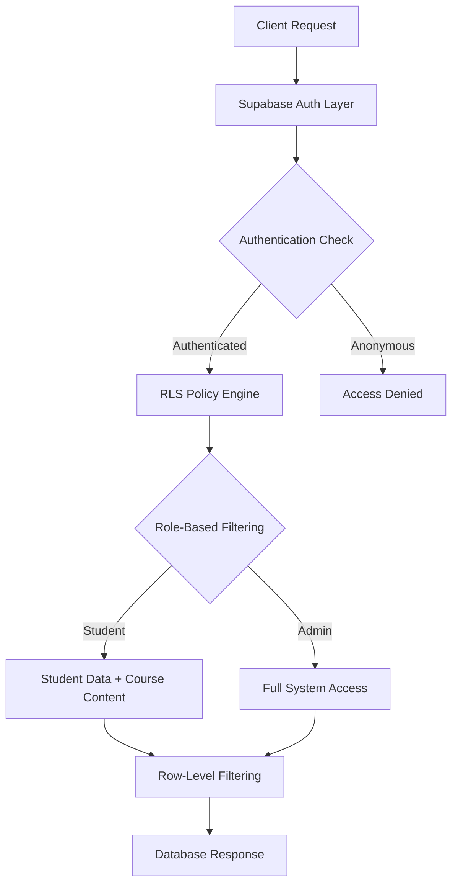
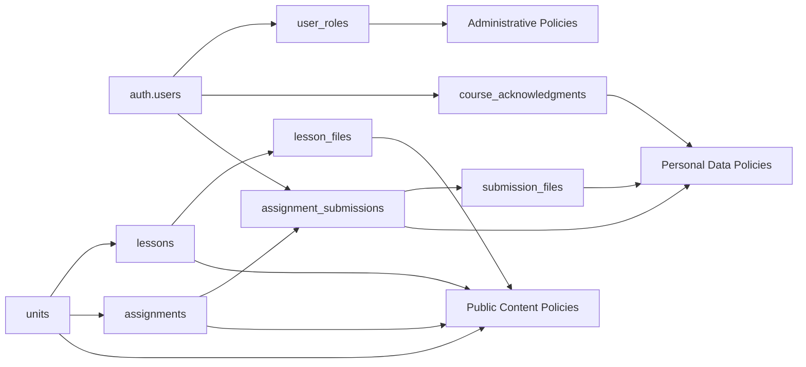

# Design Document: Database RLS Redesign

## Overview

This design document outlines the comprehensive redesign of Row Level Security (RLS) policies for the Next.js + Supabase course management system. The system currently has minimal RLS coverage (only course_acknowledgments table) and requires complete security policy implementation across all seven database tables.

The redesign establishes a three-tier access control model:
- **Anonymous users**: No access to any protected data
- **Authenticated students**: Access to public course content and their own personal data
- **Administrators**: Full system access with audit capabilities

The design prioritizes data privacy, academic integrity, and system security while maintaining performance and usability.

## Architecture

### Security Model

The RLS architecture follows a defense-in-depth approach with multiple security layers:



### Policy Categories

**1. Public Course Content Policies**
- Tables: units, lessons, lesson_files, assignments
- Access: All authenticated users (SELECT only)
- Rationale: Course materials should be accessible to all enrolled students

**2. Personal Data Policies**
- Tables: course_acknowledgments, assignment_submissions, submission_files
- Access: Users can only access their own records
- Rationale: Privacy protection and data isolation

**3. Administrative Policies**
- All tables: Full CRUD access for administrators
- Audit logging: Track administrative operations
- Rationale: System management and oversight capabilities

### Authentication Integration

The design leverages Supabase's built-in authentication system:
- `auth.uid()` function provides the current user's UUID
- Google OAuth integration maintains existing user experience
- JWT tokens ensure secure session management
- Role-based access through user metadata or dedicated roles table

## Components and Interfaces

### RLS Policy Components

**1. Authentication Helpers**
```sql
-- Helper function to check if user is administrator
CREATE OR REPLACE FUNCTION auth.is_admin()
RETURNS boolean AS $$
BEGIN
  -- Implementation will check user role/metadata
  RETURN EXISTS (
    SELECT 1 FROM auth.users 
    WHERE id = auth.uid() 
    AND raw_user_meta_data->>'role' = 'admin'
  );
END;
$$ LANGUAGE plpgsql SECURITY DEFINER;
```

**2. Policy Templates**

**Course Content Policy Template:**
```sql
-- SELECT policy for course content (units, lessons, etc.)
CREATE POLICY "authenticated_users_can_view_[table]"
ON [table] FOR SELECT
TO authenticated
USING (true);
```

**Personal Data Policy Template:**
```sql
-- SELECT policy for user-owned data
CREATE POLICY "users_can_view_own_[table]"
ON [table] FOR SELECT
TO authenticated
USING (auth.uid() = user_id);

-- INSERT policy for user-owned data
CREATE POLICY "users_can_insert_own_[table]"
ON [table] FOR INSERT
TO authenticated
WITH CHECK (auth.uid() = user_id);
```

**Administrative Policy Template:**
```sql
-- Full access for administrators
CREATE POLICY "admins_full_access_[table]"
ON [table] FOR ALL
TO authenticated
USING (auth.is_admin())
WITH CHECK (auth.is_admin());
```

### Table-Specific Policy Design

**1. Units Table**
- **Access Pattern**: Public course content
- **Policies**: 
  - SELECT for authenticated users
  - Full CRUD for administrators
- **Rationale**: Course structure should be visible to all students

**2. Lessons Table**
- **Access Pattern**: Public course content with unit relationship
- **Policies**:
  - SELECT for authenticated users
  - Full CRUD for administrators
- **Foreign Key Consideration**: Links to units table

**3. Lesson Files Table**
- **Access Pattern**: Public course resources
- **Policies**:
  - SELECT for authenticated users
  - Full CRUD for administrators
- **Security Note**: File URLs may need additional access control

**4. Assignments Table**
- **Access Pattern**: Public assignment definitions
- **Policies**:
  - SELECT for authenticated users
  - Full CRUD for administrators
- **Business Logic**: Assignment visibility may need date-based filtering

**5. Course Acknowledgments Table**
- **Access Pattern**: Personal user data (existing implementation)
- **Current Policies**: Already implemented correctly
- **Enhancement**: Add administrative access policy

**6. Assignment Submissions Table**
- **Access Pattern**: Personal user data with assignment relationship
- **Policies**:
  - SELECT/INSERT for own records only
  - No UPDATE/DELETE for data integrity
  - Full access for administrators
- **Immutability**: Preserve academic integrity

**7. Submission Files Table**
- **Access Pattern**: Personal files linked through submissions
- **Policies**:
  - Access through submission ownership chain
  - No direct user_id (requires JOIN through submissions)
  - Immutable after creation
- **Complex Filtering**: Requires subquery for ownership verification

## Data Models

### Enhanced Security Schema

**User Role Management:**
```sql
-- Option 1: Use existing auth.users metadata
-- raw_user_meta_data->>'role' = 'admin'

-- Option 2: Dedicated roles table (recommended for scalability)
CREATE TABLE user_roles (
  id UUID DEFAULT gen_random_uuid() PRIMARY KEY,
  user_id UUID NOT NULL REFERENCES auth.users(id) ON DELETE CASCADE,
  role VARCHAR(50) NOT NULL DEFAULT 'student',
  granted_at TIMESTAMP WITH TIME ZONE DEFAULT NOW(),
  granted_by UUID REFERENCES auth.users(id),
  UNIQUE(user_id, role)
);
```

**Audit Logging Schema:**
```sql
CREATE TABLE rls_audit_log (
  id UUID DEFAULT gen_random_uuid() PRIMARY KEY,
  table_name VARCHAR(255) NOT NULL,
  operation VARCHAR(10) NOT NULL, -- SELECT, INSERT, UPDATE, DELETE
  user_id UUID REFERENCES auth.users(id),
  record_id TEXT, -- Flexible to handle different ID types
  timestamp TIMESTAMP WITH TIME ZONE DEFAULT NOW(),
  user_agent TEXT,
  ip_address INET
);
```

### Policy Dependency Graph



## Migration Strategy

### Phase 1: Preparation and Analysis
1. **Current State Assessment**
   - Audit existing RLS policies
   - Identify tables without RLS protection
   - Document current access patterns

2. **Role System Setup**
   - Create user_roles table or configure metadata approach
   - Assign initial administrator roles
   - Create helper functions (auth.is_admin())

### Phase 2: Policy Implementation
1. **Course Content Tables** (Low Risk)
   - Enable RLS on units, lessons, lesson_files, assignments
   - Apply public content policies
   - Test with authenticated users

2. **Personal Data Tables** (Medium Risk)
   - Update course_acknowledgments policies (add admin access)
   - Implement assignment_submissions policies
   - Implement submission_files policies with complex ownership

3. **Administrative Policies** (High Risk)
   - Add administrative override policies to all tables
   - Test administrative access thoroughly
   - Verify audit logging functionality

### Phase 3: Validation and Rollout
1. **Comprehensive Testing**
   - Test all user scenarios (student, admin, anonymous)
   - Verify policy interactions and edge cases
   - Performance testing with realistic data volumes

2. **Gradual Deployment**
   - Deploy to staging environment first
   - Monitor for access issues or performance problems
   - Deploy to production with rollback plan ready

### Migration SQL Script Structure
```sql
BEGIN;

-- Phase 1: Setup
CREATE OR REPLACE FUNCTION auth.is_admin() ...;
CREATE TABLE IF NOT EXISTS user_roles ...;

-- Phase 2: Enable RLS and create policies
ALTER TABLE units ENABLE ROW LEVEL SECURITY;
CREATE POLICY "authenticated_users_can_view_units" ...;
-- ... (repeat for each table)

-- Phase 3: Grant permissions
GRANT SELECT ON units TO authenticated;
-- ... (repeat for each table)

-- Validation queries
-- ... (test queries to verify policies work)

COMMIT;
```

## Error Handling

### Policy Violation Scenarios

**1. Anonymous Access Attempts**
- **Error**: Permission denied for relation [table]
- **Handling**: Client-side authentication check before API calls
- **User Experience**: Redirect to login page

**2. Cross-User Data Access**
- **Error**: No rows returned (filtered by RLS)
- **Handling**: Application logic should expect empty results
- **Security**: No error message reveals existence of other users' data

**3. Administrative Access Failures**
- **Error**: Permission denied despite admin role
- **Handling**: Verify role assignment and policy configuration
- **Debugging**: Check auth.is_admin() function and user metadata

**4. Complex Query Failures**
- **Error**: Policy conflicts in JOINs across tables
- **Handling**: Ensure consistent policy logic across related tables
- **Performance**: Optimize policies to avoid expensive subqueries

### Rollback Procedures

**Emergency Rollback:**
```sql
-- Disable RLS on all tables (emergency only)
ALTER TABLE units DISABLE ROW LEVEL SECURITY;
ALTER TABLE lessons DISABLE ROW LEVEL SECURITY;
-- ... (repeat for each table)
```

**Selective Policy Rollback:**
```sql
-- Remove specific problematic policies
DROP POLICY IF EXISTS "policy_name" ON table_name;
-- Restore previous policy if needed
CREATE POLICY "old_policy_name" ON table_name ...;
```

## Testing Strategy

### Unit Testing Approach

**Policy Isolation Tests:**
- Test each policy independently with controlled data
- Verify correct filtering behavior for different user contexts
- Test edge cases like NULL user_id, missing foreign keys

**Cross-Table Integration Tests:**
- Test complex queries spanning multiple tables
- Verify JOIN operations work correctly with RLS
- Test performance impact of policy combinations

### Property-Based Testing

Property-based testing will validate universal security properties across all tables and user scenarios. Each property will be implemented as automated tests that generate random test data and verify security invariants hold consistently.

The testing approach combines:
- **Unit tests**: Specific examples, edge cases, and error conditions
- **Property tests**: Universal properties across all inputs (minimum 100 iterations each)
- **Integration tests**: End-to-end security validation

Property tests will focus on:
- Data isolation properties (users can only access their own data)
- Authentication requirements (no anonymous access to protected data)
- Administrative access properties (admins can access all data appropriately)
- Immutability properties (certain data cannot be modified after creation)

### Performance Testing

**Query Performance Validation:**
- Measure query execution time with and without RLS
- Test with realistic data volumes (1000+ users, 10000+ records)
- Identify slow queries and optimize policy conditions

**Scalability Testing:**
- Test concurrent access patterns
- Verify policy performance under load
- Monitor database resource usage

### Security Testing

**Penetration Testing Scenarios:**
- Attempt to access other users' data through various query patterns
- Test SQL injection resistance in policy conditions
- Verify that administrative privileges cannot be escalated

**Compliance Validation:**
- Verify data isolation meets privacy requirements
- Test audit logging completeness and accuracy
- Validate that no unauthorized data access is possible

## Correctness Properties

*A property is a characteristic or behavior that should hold true across all valid executions of a system—essentially, a formal statement about what the system should do. Properties serve as the bridge between human-readable specifications and machine-verifiable correctness guarantees.*

Based on the prework analysis and property reflection to eliminate redundancy, the following properties validate the core security and access control requirements:

### Property 1: Course Content Access for Authenticated Users
*For any* authenticated user and any course content table (units, lessons, lesson_files, assignments), the user should be able to SELECT all records in that table
**Validates: Requirements 3.1, 3.2, 3.3, 3.4**

### Property 2: Anonymous Access Denial
*For any* anonymous (unauthenticated) user and any protected table, all access attempts should be denied with appropriate permission errors
**Validates: Requirements 2.4, 3.5**

### Property 3: Student Data Isolation
*For any* authenticated user and any student data table (course_acknowledgments, assignment_submissions), the user should only be able to access records where user_id matches their authenticated user ID
**Validates: Requirements 4.1, 4.2**

### Property 4: Submission Files Access Control
*For any* authenticated user and submission_files table, the user should only be able to access files that are linked to their own assignment submissions through the foreign key relationship
**Validates: Requirements 4.3**

### Property 5: Student Data Insert Restrictions
*For any* authenticated user attempting to insert into student data tables, the operation should only succeed when user_id matches the authenticated user's ID
**Validates: Requirements 4.4**

### Property 6: Student Data Immutability
*For any* authenticated student user and any student data record (acknowledgments, submissions, submission files), UPDATE and DELETE operations should be denied to maintain data integrity
**Validates: Requirements 4.5, 6.1, 6.2, 6.3**

### Property 7: Administrative Full Access
*For any* administrator user and any table in the system, the administrator should have full SELECT, INSERT, UPDATE, and DELETE access to all records
**Validates: Requirements 5.1, 5.2, 5.3**

### Property 8: Administrative Audit Logging
*For any* administrative operation (INSERT, UPDATE, DELETE) performed by an administrator, an audit log entry should be created recording the operation details
**Validates: Requirements 5.5**

### Property 9: Administrative Override for Immutable Data
*For any* administrator user and any immutable student data record, the administrator should be able to perform UPDATE operations that regular users cannot
**Validates: Requirements 6.4**

### Property 10: Data Integrity Violation Rejection
*For any* user attempting invalid operations (wrong user_id, unauthorized access, constraint violations), the system should reject the operation and leave existing data unchanged
**Validates: Requirements 6.5**

### Property 11: Complex Query Access Control
*For any* complex query involving JOINs across multiple tables, the RLS policies should work together correctly to enforce proper access control without conflicts
**Validates: Requirements 8.5**

### Property 12: Comprehensive Security Coverage
*For any* unauthorized access attempt through any query path or method, the system should block the access and prevent data leakage
**Validates: Requirements 10.2**

### Property 13: User Data Privacy Compliance
*For any* user's personal data across all tables, other users should never be able to access that data through any query or operation
**Validates: Requirements 10.4**

### Property 14: Audit Trail Completeness
*For any* data access or modification operation, appropriate audit trail entries should be created showing what data was accessed and by whom
**Validates: Requirements 10.5**

## Testing Strategy

### Dual Testing Approach

The testing strategy employs both unit testing and property-based testing to ensure comprehensive coverage:

**Unit Tests:**
- Specific examples of policy behavior with known data sets
- Edge cases like NULL user_id, missing foreign keys, invalid tokens
- Error condition testing (malformed queries, constraint violations)
- Integration points between authentication and RLS policies
- Migration validation with before/after state verification

**Property-Based Tests:**
- Universal security properties across randomized inputs (minimum 100 iterations each)
- Comprehensive input coverage through generated test data
- Validation of security invariants under all conditions
- Cross-table policy interaction testing with random query patterns

### Property-Based Testing Configuration

**Testing Framework:** 
- **PostgreSQL + pgTAP**: For database-level property testing
- **Jest + fast-check**: For application-level integration testing
- **Supabase Test Client**: For end-to-end authentication flow testing

**Test Configuration:**
- Minimum 100 iterations per property test due to randomization
- Each property test references its design document property
- Tag format: **Feature: database-rls-redesign, Property {number}: {property_text}**
- Isolated test database with controlled user accounts and data

**Property Test Implementation Pattern:**
```javascript
// Example property test structure
test('Property 3: Student Data Isolation', async () => {
  await fc.assert(fc.asyncProperty(
    fc.array(userGenerator, { minLength: 2, maxLength: 10 }),
    fc.array(acknowledgmentGenerator, { minLength: 5, maxLength: 50 }),
    async (users, acknowledgments) => {
      // Setup: Create users and acknowledgments
      // Test: Each user queries acknowledgments
      // Verify: Each user only sees their own records
    }
  ), { numRuns: 100 });
});
```

### Security Testing Scenarios

**Penetration Testing:**
- SQL injection attempts through policy conditions
- Authentication bypass attempts
- Cross-user data access attempts through various query patterns
- Administrative privilege escalation attempts
- Concurrent access race condition testing

**Performance Impact Testing:**
- Query execution time comparison with/without RLS
- Large dataset filtering performance (1000+ users, 10000+ records)
- Complex JOIN query performance with multiple RLS policies
- Index utilization verification for auth.uid() comparisons

**Migration Testing:**
- Policy application in transaction isolation
- Rollback procedure validation
- Data consistency verification during migration
- Zero-downtime migration validation

### Compliance and Audit Testing

**Privacy Compliance:**
- Verify complete data isolation between users
- Test that no query path allows unauthorized data access
- Validate audit trail completeness and accuracy
- Confirm administrative access controls and logging

**Security Audit:**
- Verify all sensitive tables have RLS enabled
- Test policy coverage for all CRUD operations
- Validate authentication integration points
- Confirm no security gaps in policy interactions

The comprehensive testing approach ensures that the RLS redesign meets all security, privacy, and performance requirements while maintaining system reliability and user experience.